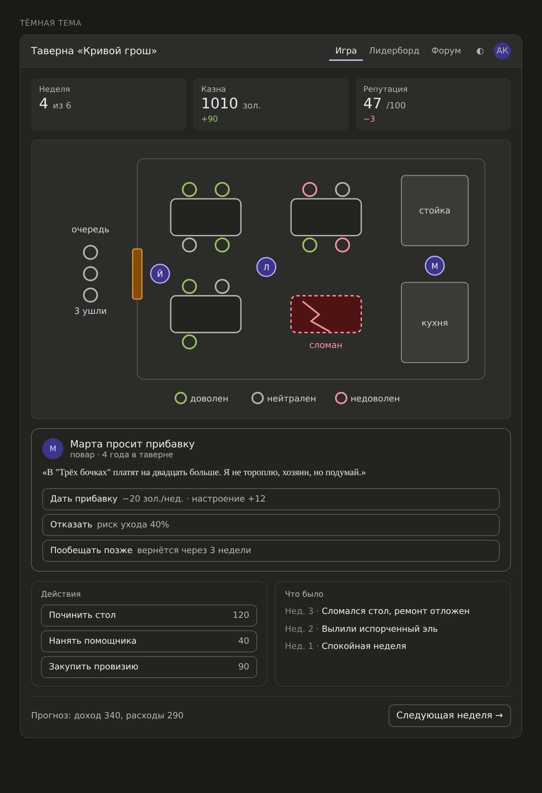

# Таверна

Браузерная игра: пошаговый экономический симулятор средневековой таверны.
React + TypeScript, игровой зал отрисовывается через Canvas API.

Учебный проект курса «Мидл фронтенд-разработчик».

> **Демо:** _ссылка появится после первого деплоя_



## Что это за игра

Игрок управляет придорожной таверной шесть недель. Каждую неделю приходит происшествие,
на которое надо как-то ответить, и есть немного денег на три действия: починить стол,
нанять помощника, закупить провизию.

Репутация определяет, сколько гостей придёт. Она растёт медленно и падает быстро —
сэкономил на ремонте один раз, потерял поток гостей на три недели. Цель — дожить
до конца сезона не разорившись и набрать больше очков, чем другие в лидерборде.

Партия занимает 5–7 минут.

## Документация

| Файл | О чём |
|---|---|
| [docs/game-plan.md](docs/game-plan.md) | Что за игра, что видит игрок, как проходит партия |
| [docs/architecture.md](docs/architecture.md) | Слои, границы модулей, ограничения SSR |
| [docs/contributing.md](docs/contributing.md) | Правила разработки, git, ревью и спринта |
| [AGENTS.md](AGENTS.md) | Инструкции для AI-помощников |

Актуальные задачи — на доске в GitHub Projects.

## Стек

| Слой | Технологии |
|---|---|
| Клиент | React, TypeScript, Redux Toolkit, React Router, Vite, SSR |
| Игра | Чистый TypeScript, Canvas API |
| Сервер | Node, Express, PostgreSQL, Sequelize |
| Инфраструктура | Lerna, Docker, Nginx, GitHub Actions, Yandex Cloud (прод), Vercel (превью PR) |

Авторизация, профиль и лидерборд — через готовое API курса.
Свой бэкенд отвечает только за форум и хранение тем оформления.

```
packages/client/    # фронтенд
packages/server/    # свой бэкенд: форум и темизация
docs/               # документация проекта
```

## Как мы работаем

- Ветка на задачу, мерж только через pull request
- Минимум один апрув, отсматриваем PR в течение суток
- CI обязан быть зелёным: линтер, тайпчек, тесты
- Задача закрыта после мержа, а не после «локально работает»
- Заморозка фич — середина седьмого спринта, дальше только багфиксы

Подробно — в [docs/contributing.md](docs/contributing.md): ветки, PR, ревью.

Перед первым PR прочитайте [docs/architecture.md](docs/architecture.md) —
там границы слоёв и ограничения SSR, которые проверяются на ревью.

### Как запускать?

1. Убедитесь что у вас установлен `node` и `docker`
2. Выполните команду `yarn bootstrap` - это обязательный шаг, без него ничего работать не будет :)
3. Выполните команду `yarn dev`
4. Выполните команду `yarn dev --scope=client` чтобы запустить только клиент
5. Выполните команду `yarn dev --scope=server` чтобы запустить только server


### Как добавить зависимости?
В этом проекте используется `monorepo` на основе [`lerna`](https://github.com/lerna/lerna)

Чтобы добавить зависимость для клиента 
```yarn lerna add {your_dep} --scope client```

Для сервера
```yarn lerna add {your_dep} --scope server```

И для клиента и для сервера
```yarn lerna add {your_dep}```


Если вы хотите добавить dev зависимость, проделайте то же самое, но с флагом `dev`
```yarn lerna add {your_dep} --dev --scope server```


### Тесты

Для клиента используется [`react-testing-library`](https://testing-library.com/docs/react-testing-library/intro/)

```yarn test```

### Линтинг

```yarn lint```

### Форматирование prettier

```yarn format```

### Production build

```yarn build```

И чтобы посмотреть что получилось


`yarn preview --scope client`
`yarn preview --scope server`

## Хуки
В проекте используется [lefthook](https://github.com/evilmartians/lefthook)
Если очень-очень нужно пропустить проверки, используйте `--no-verify` (но не злоупотребляйте :)

## Ничего не работает

Заведите issue: что делали, что ожидали, что получилось, версия Node и вывод команды.
Разберёмся.

## Превью-деплой PR на Vercel

Каждый PR автоматически деплоится на Vercel, URL присылает бот. `root directory` —
`packages/client`.

Это **витрина для ревью, а не прод**: превью собирается статикой, без серверного рендера.
Продакшен живёт в Yandex Cloud, там же меряется Lighthouse.

## Production окружение в докере
Перед первым запуском выполните `node init.js`


`docker compose up` - запустит три сервиса
1. node, отдающий клиент с серверным рендером (client) — см. `Dockerfile.client`
2. node, ваш сервер (server)
3. postgres, вашу базу данных (postgres)

Nginx в этой связке пока не участвует: он появится в проде как reverse-proxy с SSL,
чтобы фронт, свой бэкенд и API курса жили на одном origin (задача 1.14).

Если вам понадобится только один сервис, просто уточните какой в команде
`docker compose up {sevice_name}`, например `docker compose up server`